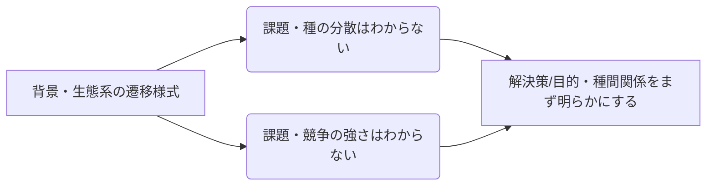

## 原則  
### 一貫性
- 見たい問い・課題を中心に、*直接的*な背景・解決策・目的・手法を述べる.  
- そのために１段落１トピックを心掛ける.　　
　　
悪い例1.　　
2つの課題に対し、一つの課題しか解決しようとしない.　　

  
良い例1.

種間関係は、生態系の遷移様式を規定要因の一つではあるが、そこまで大きい話を１段落を使ってしないほうがいい.  
大きい背景は１文で説明.

### 具体性
- 抽象的な言葉は使わないで、先行研究の中でも*誰もがイメージしやすい例*をあげる.  
例：「水質浄化能力」→　「毒性のアンモニアを無害化する能力」  
- 自分の研究を述べる時は、何がすごいかを書く.  
例：「この指標で予測できることを初めて実証した」で終わらず、「この指標を使えば、７日先までを予測できることを初めて実証した」  
  
### スタンス  
- 研究内容を伝えるのではなく、自分が何者か・何ができるのかを伝える気持ちで書く.  

------------------------------------------------------------------------
## 研究費ごとのポイント
### 科研費（日本学術振興会:JSPS)

1-2ページで以下をまとめる  
#### 概要
-   背景・問い・目的と内容・研究達成により得られる成果を最大10行

#### 背景
-   前半に分野の背景、後半に自分の研究の構成
-   図入りで１ページが目安
-   審査員は勉強してその分野に詳しくなりたいわけではない

#### 着想に至った経緯
-   研究課題に取り組もうと思った理由・課題にたどりついた経緯
-   個人的な研究活動の経験を踏まえて述べる

#### 研究課題の核心をなす学術的「問い」
-   研究分野において解決しなければならない課題
-   問題と解決の必要性の理由を書く
-   「しかしながら〜」で書く

#### 目的　　
-   学術的「問い」を解決することなので、前節に重複してもOK

#### 学術的独自性と創造性　　
-   学術的独自性\
    以下が伝わるように書く
    -   申請課題の重要性
    -   オリジナリティ
    -   申請者でないとできない理由・優位性
    -   他の研究と比較して書く
    -   ただし、自分の上位互換は気にしなくていい\
-   創造性
    -   研究分野に与えるインパクト
    -   研究の展開
    -   他の研究分野、学術全般、あるいは社会に対してどのような影響（波及効果）
    -   独自性と分量が同程度になるように注意

#### 関連する国内外の研究動向と本研究の位置づけ　　
-   学術的「問い」の解決に取り組んでいる国内外の最近 の研究について述べる
-   ワークショップやシンポジウムを取り上げてもよい？
-   後半で、申請課題の研究と他の人の先行研究を比較したときの相違点と優位性を述べる

#### 本研究で何をどのように、どこまで明らかにしようとするのか

-   申請書の中で一番重要。図を含めて 1 ページ以上
-   冒頭に全研究計画の概要と使用する方法を簡潔にまとめる
-   独立に実施できるサブテーマを立てる. 1つのテーマが破綻しても問題がないことをアピール

------------------------------------------------------------------------

### 日本学術振興会:JST
- 言葉を強めに書くと良い印象
例：「組成が変化する」→　「組成が崩壊する」
